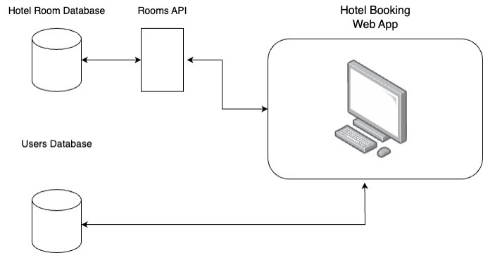

# CST452-Portfolio

This application was created for CST-451 and CST 452. The online hotel booking system aims to develop a user-friendly web application that enables users to select, view, and reserve hotel rooms online. It will feature a database of hotel rooms with room availability, pricing information, and details. Users will be able to create accounts and manage their bookings. The application seeks to streamline the hotel booking process enhancing convenience for users.

## Design
The hotel room database will contain information about each hotel room such as price, availability, room number, etc. The user database will be used to store and authenticate user information. The web app will directly connect to the user database to store newly created users and validate user login information. The hotel room database will be accessible only to the web app via the Room API interface. Through this interface, the web app will be able to perform CRUD operations such as reading all the available rooms and updating the availability. Here is the high-level design:

## Code
Room API - https://github.com/arleaf/RoomAPI
Hotel Booking Web App- https://github.com/arleaf/hotel_booking

## Video Demo
To see the final presentation for this application, please view here:
https://www.loom.com/share/da56beced3f3406181bd3016187d96af

In depth demo on Rooms API here: 
https://www.loom.com/share/014f6052c4144d6b81b1f0703a3f7a12
